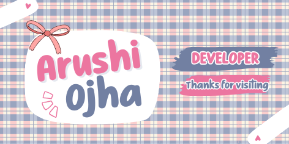

  

<h1 align="center" style="color: #E6007A;">Arushi Ojha</h1>

  

  
  

---

<h2 align="center" style="color: #E6007A;">About Me</h2>

  Passionate Software Engineering student focusing on data structures, backend development, and cloud technologies. 
  Actively involved in technical leadership as a Campus Mantri for GeeksforGeeks and contributing to open-source programs like GSSoC, Hacktoberfest, and SWoC.

---

<h2 align="center" style="color: #E6007A;">GitHub Analytics & Activity</h2>

  
  

<!-- 
  NOTE: This snake animation requires a GitHub Action setup in your repository.
  You need to create a workflow file (e.g., .github/workflows/snake.yml) that uses 'platane/snk' 
  to generate the SVG file. Below is the image link that will display the generated SVG.
-->

  

---

<h2 align="center" style="color: #E6007A;">Technical Skills & Arsenal</h2>

  

---

<h2 align="center" style="color: #E6007A;">Core Capabilities</h2>

<table align="center" width="100%">
  <tr>
    <td width="50%" valign="top">
      <h4 style="color: #E6007A;">Backend Engineering & API Design</h4>
      <ul>
        <li>Developing robust APIs and microservices using <b>Python (FastAPI, Flask)</b> and <b>Node.js (Express)</b>.</li>
        <li>Database modeling and management with SQL and NoSQL (MongoDB).</li>
        <li>Implementing application logic and predictive modeling integration.</li>
      </ul>
      

        
        
        
      

    </td>
    <td width="50%" valign="top">
      <h4 style="color: #E6007A;">Full-Stack & Desktop Application Development</h4>
      <ul>
        <li>Building interactive user interfaces with <b>React.js</b>.</li>
        <li>Cross-platform desktop application development using <b>Electron</b>.</li>
        <li>Experience with data visualization and application auto-update implementations.</li>
      </ul>
      

        
        
        
      

    </td>
  </tr>
  <tr>
    <td width="50%" valign="top">
      <h4 style="color: #E6007A;">Systems Programming & Cloud Architecture</h4>
      <ul>
        <li>Strong foundation in Data Structures and Algorithms using <b>C++</b>.</li>
        <li>Deploying and managing infrastructure on <b>Google Cloud Platform (GCP)</b>.</li>
        <li>Version control and collaborative workflow management with Git/GitHub.</li>
      </ul>
      

        
        
        
      

    </td>
    <td width="50%" valign="top">
      <!-- You can add a fourth capability or leave this empty for balance -->
    </td>
  </tr>
</table>

---

  Let's connect and build something impactful.

