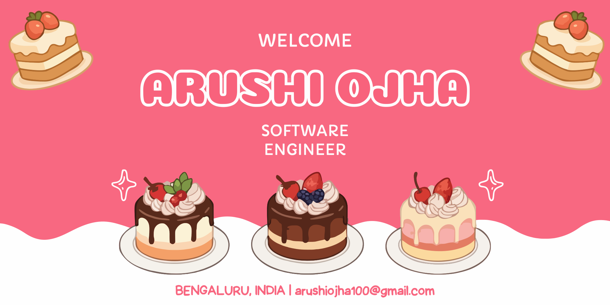
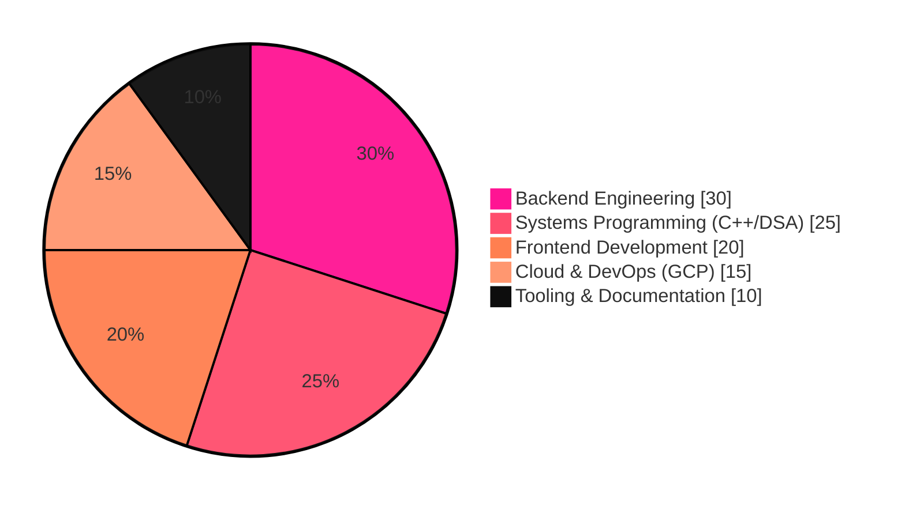
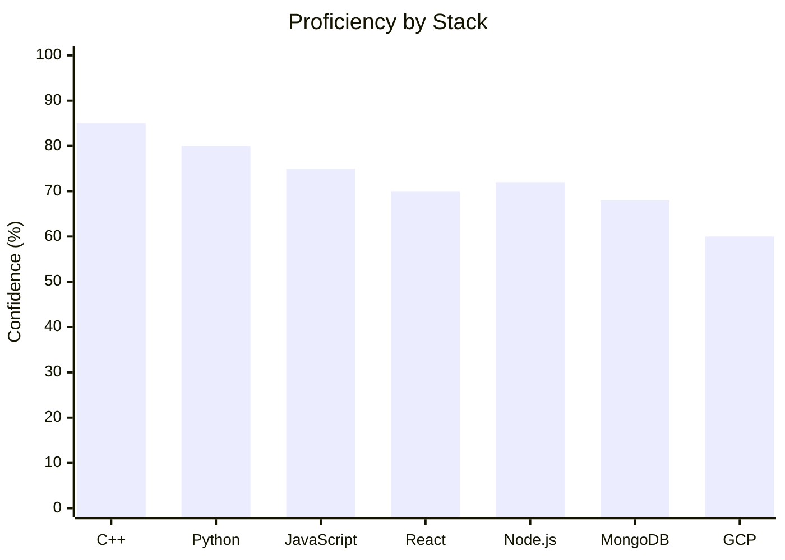

 

 

 

## &#9679; About Me

<table align="center">
  <tr>
    <td><b>&#9670; Current Role</b></td>
    <td>Software Engineer in Training</td>
  </tr>
  <tr>
    <td><b>&#9670; Location</b></td>
    <td>Bengaluru, Karnataka, India</td>
  </tr>
  <tr>
    <td><b>&#9670; Core Focus</b></td>
    <td>Scalable Backend &amp; Cloud Architecture</td>
  </tr>
  <tr>
    <td><b>&#9670; Education</b></td>
    <td>B.Sc. Physics, Mathematics &amp; Computer Science — Jain (Deemed-to-be University)</td>
  </tr>
  <tr>
    <td><b>&#9670; Objective</b></td>
    <td>Actively seeking Software Engineering internships</td>
  </tr>
</table>

## &#9679; Contact &amp; Professional Links

 

## &#9679; Tech Stack

### &#9671; Backend Engineering &amp; Database

### &#9671; Frontend &amp; Desktop Development

### &#9671; Systems Programming &amp; Cloud

### &#9671; Developer Tools &amp; Environment

## &#9679; Area of Expertise

## &#9679; GitHub Analytics

 

 

## &#9679; Snake Contribution Graph

Generated via the <a href="https://github.com/Platane/snk">Platane/snk</a> GitHub Action — set it up in your repo workflows to enable the animated graph above.

<i>Thanks for stopping by — always open to collaborating on interesting backend &amp; cloud projects.</i>

